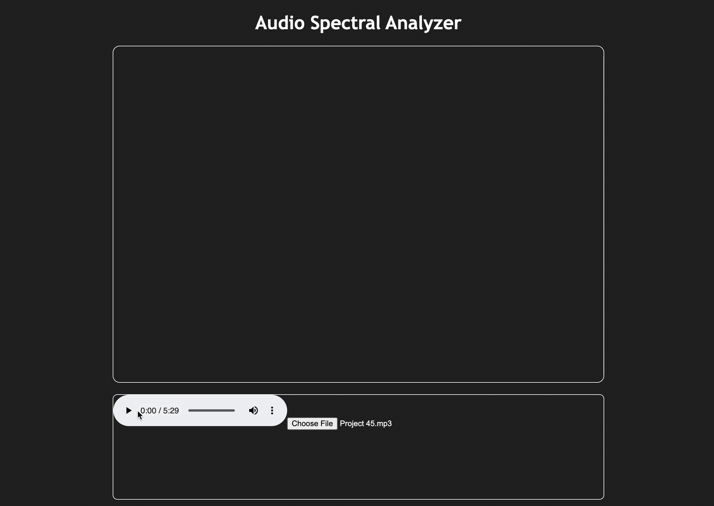

# Spectral Analyzer

An audio waveform analyzer that provides user with real-time waveform amplitude and frequency data. Inspired by Graphic EQ systems.

This app will allow users to upload audio files or use their computer's input (e.g. microphone, audio interface) to see real-time frequency data. There will be additional functionality to trace frequency data over time to provide user visual representations of the audio to aid in performing EQ and compression mixing techniques on their audio files.

JavaScript Web APIs feature a powerful Web Audio API that I may use. I am however interested in writing my own Fast Fourier Transform algorithm and I may end up hard-coding the playback and visualization logic for educational purposes.

Currently in early-development, check back soon.

## Demo

